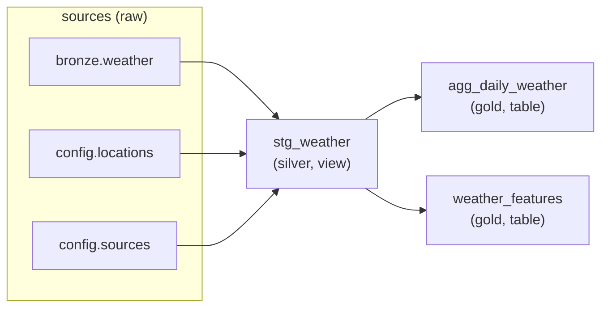

# Learn dbt Core — A Student's Guide (using env-data-pipeline)

> **Who this is for:** students who know some **SQL** but have never used dbt.
> By the end you'll understand *what* dbt is, *why* it exists, and *how* every part of it works —
> using this project's real weather pipeline as the running example.
>
> **How to read this:** go top to bottom the first time. Each chapter builds on the last. Code you can find
> in this repo is shown as file references; illustrative snippets are plain code blocks. There are
> **"Try it"** exercises along the way.

---

## Table of Contents

1. [What is dbt (and what it is NOT)](#1-what-is-dbt-and-what-it-is-not)
2. [dbt Core vs dbt Cloud](#2-dbt-core-vs-dbt-cloud)
3. [The mental model: dbt = SQL SELECTs + a DAG](#3-the-mental-model-dbt--sql-selects--a-dag)
4. [Installing dbt & how it connects (profiles)](#4-installing-dbt--how-it-connects-profiles)
5. [Anatomy of a dbt project](#5-anatomy-of-a-dbt-project)
6. [Sources — naming your raw data](#6-sources--naming-your-raw-data)
7. [Models — the heart of dbt](#7-models--the-heart-of-dbt)
8. [`ref()` and `source()` — building the DAG](#8-ref-and-source--building-the-dag)
9. [Materializations — view, table, incremental, ephemeral](#9-materializations--view-table-incremental-ephemeral)
10. [Configuration & the `generate_schema_name` macro](#10-configuration--the-generate_schema_name-macro)
11. [Jinja & templating](#11-jinja--templating)
12. [Tests — trusting your data](#12-tests--trusting-your-data)
13. [Documentation & lineage](#13-documentation--lineage)
14. [Macros & packages (dbt_utils)](#14-macros--packages-dbt_utils)
15. [Seeds & snapshots (brief)](#15-seeds--snapshots-brief)
16. [The dbt command line](#16-the-dbt-command-line)
17. [How dbt runs inside this project (Airflow)](#17-how-dbt-runs-inside-this-project-airflow)
18. [End-to-end walkthrough: bronze → silver → gold](#18-end-to-end-walkthrough-bronze--silver--gold)
19. [Glossary](#19-glossary)
20. [Where to go next](#20-where-to-go-next)

---

## 1. What is dbt (and what it is NOT)

**dbt** (data build tool) is a tool for the **"T" in ELT** — the *Transform* step. Data is first **E**xtracted
and **L**oaded into a warehouse as raw data (in this project, our Python pipeline loads raw JSON into
`bronze.weather`). dbt then **T**ransforms that raw data into clean, trustworthy, analytics-ready tables —
**using nothing but `SELECT` statements**.

**The big idea:** you write a `SELECT` query that describes *what a table should contain*. dbt takes care of
the boring, error-prone parts:

- wrapping your query in `CREATE TABLE AS` / `CREATE VIEW AS`,
- running your models **in the right order**,
- managing schemas/environments (dev vs prod),
- testing the data, and
- generating documentation.

**dbt IS:**
- A transformation framework that runs SQL *inside your existing database/warehouse*.
- A way to apply software-engineering practices (version control, modularity, testing, docs) to SQL.

**dbt is NOT:**
- ❌ A database or a query engine — it does **not** store or process data itself. It sends SQL to Postgres
  (in our case) and Postgres does the work.
- ❌ An orchestrator/scheduler — it doesn't decide *when* to run. Here, **Airflow** schedules dbt (see §17).
- ❌ An extraction/loading tool — getting data *into* `bronze` is done by our Python pipeline, not dbt.

> **In this project:** the raw data already lives in `bronze.weather`. dbt's job is to turn it into
> `silver.stg_weather`, then `gold.agg_daily_weather` and `gold.weather_features`.

---

## 2. dbt Core vs dbt Cloud

| | **dbt Core** | **dbt Cloud** |
|---|---|---|
| What | Free, open-source **command-line** tool (Python package) | Hosted web platform built on top of Core |
| Run how | `dbt run` in a terminal / CI / Airflow | Browser IDE + managed scheduler |
| Cost | Free | Paid tiers (has a free developer tier) |
| Scheduling | You bring your own (cron, Airflow…) | Built-in |

**This project uses dbt Core** (`dbt-postgres==1.7.0` in `requirements.txt`), invoked by Airflow's
`BashOperator`. Everything in this guide is about **dbt Core**.

---

## 3. The mental model: dbt = SQL SELECTs + a DAG

Two ideas explain 80% of dbt:

**(1) Every model is a `SELECT`.** You never write `CREATE TABLE`. You write:

```sql
SELECT ... FROM ...
```

and configure *how* dbt should persist it (as a `view` or a `table`, etc.). dbt does the DDL for you.

**(2) Models reference each other, forming a DAG.** Instead of hard-coding table names, you write
`{{ ref('other_model') }}`. dbt reads all these references and builds a **DAG** (Directed Acyclic Graph —
a dependency graph with no cycles). That DAG tells dbt the **correct build order**.

In this project the DAG is:



You never tell dbt "build silver before gold." dbt figures that out because `agg_daily_weather` does
`{{ ref('stg_weather') }}`, so `stg_weather` *must* exist first.

---

## 4. Installing dbt & how it connects (profiles)

### 4.1 Install

dbt is a Python package. You install an **adapter** for your database. This project uses Postgres:

```bash
pip install dbt-postgres==1.7.0   # installs dbt-core + the postgres adapter
dbt --version
```

### 4.2 The `profiles.yml` — dbt's connection secrets

dbt separates **project code** (models, committed to git) from **connection details** (credentials, kept out
of git). Connection details live in `profiles.yml`. In this repo it's at `dbt_project/profiles.yml` and is
**gitignored** (and mounted from `~/.dbt` inside Docker).

```1:12:dbt_project/profiles.yml
dbt_project:
  target: dev
  outputs:
    dev:
      type:     postgres
      host:     "{{ env_var('DB_HOST', 'host.docker.internal') }}"
      port:     "{{ env_var('DB_PORT', '5432') | int }}"
      dbname:   "{{ env_var('DB_NAME', 'weather_db') }}"
      user:     "{{ env_var('DB_USER', 'soytry_pipline') }}"
      password: "{{ env_var('DB_PASSWORD', 'soytry_pipline') }}"
      schema:   public
      threads:  4
```

Reading this line by line, as a student should:

- **`dbt_project:`** — the **profile name**. It must match the `profile:` line in `dbt_project.yml` (see §5).
- **`target: dev`** — the *default* environment to use. There are two `outputs` here: `dev` and `prod`.
- **`type: postgres`** — which adapter/warehouse.
- **`host / port / dbname / user / password`** — how to connect. Here they use `env_var(...)` so the real
  values come from environment variables (the `DB_*` vars), with sensible fallbacks. This is why the same
  code works locally and in Docker.
- **`schema: public`** — the **default** schema dbt writes to *unless a model overrides it*. (Our models
  override it to `silver`/`gold` — see §10.)
- **`threads: 4`** — how many models dbt builds in parallel when their dependencies allow.

> **Try it:** run `dbt debug` — it checks that dbt can find your project and successfully connect using this
> profile. This is always your first troubleshooting step.

---

## 5. Anatomy of a dbt project

Every dbt project has a **`dbt_project.yml`** at its root. That's what makes a folder "a dbt project."

```1:19:dbt_project/dbt_project.yml
name: dbt_project
version: 1.0.0
config-version: 2

profile: dbt_project

model-paths:  ["models"]
macro-paths:  ["macros"]
test-paths:   ["tests"]
seed-paths:   ["seeds"]

models:
  dbt_project:
    silver:
      +materialized: view
      +schema: silver
    gold:
      +materialized: table
      +schema: gold
```

Key parts:

- **`name`** — the project name. Note it appears again under `models:` — configuration is keyed by project
  name.
- **`profile: dbt_project`** — links to the profile in `profiles.yml` (§4.2). These two names must match.
- **`*-paths`** — where dbt looks for each resource type. Models in `models/`, macros in `macros/`, etc.
- **`models:` block** — **folder-level configuration**. Read it as a tree that mirrors your folders:
  - everything under `models/silver/` → materialized as a **view**, written to the **`silver`** schema.
  - everything under `models/gold/` → materialized as a **table**, written to the **`gold`** schema.

This is a huge convenience: instead of configuring every file, you set defaults by folder. Individual models
can still override (and ours do, redundantly, inside their `config()` blocks).

Our project's dbt folder:

```
dbt_project/
├── dbt_project.yml          # project config (above)
├── profiles.yml             # connection (gitignored)
├── packages.yml             # external packages (dbt_utils)
├── package-lock.yml         # pinned package versions
├── macros/
│   └── generate_schema_name.sql   # custom schema naming (§10)
└── models/
    ├── sources.yml          # declares raw sources (§6)
    ├── silver/
    │   ├── stg_weather.sql  # the model (SELECT)
    │   └── stg_weather.yml  # its docs + tests
    └── gold/
        ├── agg_daily_weather.sql / .yml
        └── weather_features.sql / .yml
```

**Naming convention you'll see everywhere:** a model `x.sql` often has a sibling `x.yml` holding its
description and tests. dbt doesn't *require* the names to match, but pairing them keeps things tidy.

---

## 6. Sources — naming your raw data

A **source** is dbt's way of pointing at tables that were loaded by something *else* (our Python pipeline).
You declare them once in a YAML file, then reference them with `{{ source(...) }}`.

```1:28:dbt_project/models/sources.yml
version: 2

sources:
  - name: bronze
    description: "Raw ingested data from the pipeline"
    schema: bronze
    tables:
      - name: weather
        description: "Raw weather readings stored as JSONB — partitioned by year"
        columns:
          - name: id
            description: "Auto-incremented primary key"
          - name: source_id
            description: "FK to config.sources (application-level)"
            tests:
              - not_null
          - name: location_id
            description: "FK to config.locations (application-level)"
            tests:
              - not_null
          - name: observation_at
            description: "Timestamp of the weather reading from the API"
            tests:
              - not_null
          - name: raw_data
            description: "Complete raw API response as JSONB"
            tests:
              - not_null
```

What this gives you:

- **A stable name.** In models you write `{{ source('bronze', 'weather') }}` instead of `bronze.weather`.
  If the physical table ever moves, you change it in one place.
- **Lineage.** dbt now knows models that select from this source *depend on* it.
- **Tests on raw data.** Notice `not_null` tests on `source_id`, `location_id`, etc. You can catch bad raw
  data before it poisons downstream tables.

This project declares two sources: **`bronze`** (the raw weather table) and **`config`** (the seeded
`sources` / `locations` / `source_locations` tables).

> **Source vs Seed vs Model — don't confuse them:**
> - **Source** = a table someone *else* created; dbt only reads it.
> - **Seed** = a small CSV *in the dbt project* that dbt loads (see §15).
> - **Model** = a table/view dbt *creates* from a `SELECT`.

---

## 7. Models — the heart of dbt

A **model** is a single `.sql` file containing one `SELECT`. The **file name becomes the table/view name**.
So `stg_weather.sql` produces a relation named `stg_weather`.

Let's read our silver model's structure (full file: `dbt_project/models/silver/stg_weather.sql`):

```1:24:dbt_project/models/silver/stg_weather.sql
{{ config(
    materialized = 'view',
    indexes = [
        {'columns': ['location_id', 'observation_date']},
        {'columns': ['observation_year']},
    ]
) }}
WITH bronze AS (

    SELECT * FROM {{ source('bronze', 'weather') }}

),

config_locations AS (

    SELECT * FROM {{ source('config', 'locations') }}

),
```

Three things a student should notice:

1. **The `{{ config(...) }}` block** at the top sets model-specific settings (here: materialize as a `view`,
   plus index hints). This is the in-file alternative to the folder config in `dbt_project.yml`.
2. **`{{ source('bronze', 'weather') }}`** — reading a source (see §6/§8).
3. **CTEs (`WITH ... AS`)** — this project uses a clean, readable "CTE pipeline" style: import CTEs at the top,
   then transformation steps, then a final `SELECT`. This is a widely recommended dbt style.

The rest of `stg_weather.sql` is *just SQL you already know*: it unpacks JSONB into typed columns, adds derived
columns (weather description, rainy season, heat index, comfort level), and deduplicates with `DISTINCT ON`.
**dbt didn't invent new SQL** — it just manages and wires these queries together.

> **Try it:** open `stg_weather.sql`. Find where it computes `season`. Notice it's plain `CASE WHEN
> observation_month BETWEEN 5 AND 10 THEN 'rainy' ELSE 'dry' END`. That's the whole trick — business logic
> lives in readable SQL, versioned in git.

---

## 8. `ref()` and `source()` — building the DAG

These two Jinja functions are how dbt understands dependencies. **Never hard-code a table name** — always use
one of these.

### `{{ source('<source_name>', '<table_name>') }}`
Points at a **raw** table declared in `sources.yml`. Used only in your first-layer (staging) models.

```10:10:dbt_project/models/silver/stg_weather.sql
    SELECT * FROM {{ source('bronze', 'weather') }}
```

### `{{ ref('<model_name>') }}`
Points at **another dbt model**. This is what stitches the DAG together.

```8:12:dbt_project/models/gold/agg_daily_weather.sql
WITH silver AS (

    SELECT * FROM {{ ref('stg_weather') }}

),
```

Because `agg_daily_weather` **refs** `stg_weather`, dbt knows to build `stg_weather` first. Same for
`weather_features`. You get the build order **for free**.

**Why this matters (the payoff):**
- **Correct ordering**, always — even with hundreds of models.
- **Environment-aware.** In `dev`, `ref('stg_weather')` compiles to your dev schema's table; in `prod`, the
  prod one. You write the code once.
- **Lineage/impact analysis.** dbt can answer "what breaks if I change `stg_weather`?" (answer: both gold
  models).

> **Rule of thumb:** staging models `source()` from raw; everything downstream `ref()`s other models.

---

## 9. Materializations — view, table, incremental, ephemeral

A **materialization** is *how* dbt persists a model in the database. You pick it; dbt writes the DDL.

| Materialization | dbt builds it as | Rebuilt how | Good for |
|-----------------|------------------|-------------|----------|
| **`view`** | `CREATE VIEW` | Query runs fresh every time you read it | Light transforms, always-current data (our **silver**) |
| **`table`** | `CREATE TABLE AS` | Fully dropped & rebuilt on each `dbt run` | Expensive queries read often (our **gold**) |
| **`incremental`** | `CREATE TABLE`, then `INSERT`/`MERGE` new rows | Only processes *new* rows after first build | Huge, append-mostly tables |
| **`ephemeral`** | *not built* — inlined as a CTE into models that ref it | N/A | Reusable logic you don't want to persist |

**In this project:**

- **Silver (`stg_weather`) = `view`.** Set both in `dbt_project.yml` (`silver: +materialized: view`) and in
  the file's `config()`. A view stores no data; it's a saved query. Reading it always reflects the latest
  bronze rows. Cheap to build, slightly slower to read.
- **Gold (`agg_daily_weather`, `weather_features`) = `table`.** These do heavy aggregation, window functions,
  and lags. Materializing as tables means the expensive computation happens once per `dbt run`, and BI tools /
  the ML step read fast, pre-computed results.

```1:6:dbt_project/models/gold/weather_features.sql
{{
    config(
        materialized = 'table',
        schema       = 'gold'
    )
}}
```

> **Discussion — why not make gold `incremental`?**
> `weather_features` uses `LAG`/`LEAD`/rolling windows that look across many days per province. Incremental
> models are trickier when new rows depend on historical context. For a teaching project, `table` (full
> rebuild nightly) is simpler and correct. Incremental would be a great *next* optimization once data volume
> grows.

---

## 10. Configuration & the `generate_schema_name` macro

### 10.1 Where config comes from (precedence)

You can configure a model in three places. From **lowest to highest** priority:

1. `dbt_project.yml` (folder-level defaults)
2. a `config()` block **inside the `.sql` model** (this wins)

(There's also property-file config, but the two above are what this project uses.) Our project sets the same
values in both places (e.g. gold = table), which is redundant but harmless and makes each file
self-descriptive.

### 10.2 Why our schemas are named `silver`/`gold` exactly

By **default**, dbt does something surprising to beginners: when you set a custom schema, it *concatenates*
`<profile_schema>_<custom_schema>`. So with `schema: public` in the profile and `+schema: gold`, you'd get a
schema literally called **`public_gold`** — not `gold`.

This project doesn't want that. It **overrides** dbt's schema-naming macro so the custom name is used *as-is*:

```1:9:dbt_project/macros/generate_schema_name.sql


    
        {{ target.schema }}
    
        {{ custom_schema_name | trim }}
    


```

Read it as: *"If a model didn't specify a schema, use the profile's default (`target.schema`, i.e. `public`).
Otherwise, use exactly the custom name I gave (`silver` / `gold`), trimmed of whitespace."*

This is a great first example of **overriding a built-in dbt macro** by defining a macro with the same name in
your `macros/` folder. dbt uses yours instead of its default.

> **Try it:** temporarily rename this macro (e.g. `generate_schema_name_DISABLED`), run `dbt run`, and watch
> dbt create `public_silver` / `public_gold` instead. Then restore it. Seeing the default behavior once makes
> the override obvious.

---

## 11. Jinja & templating

Everything in `{{ ... }}` and `` is **Jinja**, a templating language. dbt **compiles** your model:
it first renders the Jinja into pure SQL, *then* sends that SQL to Postgres. You've already used Jinja:

- `{{ source('bronze', 'weather') }}` → compiles to `bronze.weather`
- `{{ ref('stg_weather') }}` → compiles to `silver.stg_weather`
- `{{ config(...) }}` → sets model config (renders to nothing in the final SQL)
- `{{ env_var('DB_HOST', '...') }}` → reads an environment variable (used in `profiles.yml`)

Jinja adds programmability to SQL:

- **Variables:** `` … `{{ x }}`
- **Logic:** ` ...  ... ` (see the macro in §10)
- **Loops:** ` ... ` — great for generating repetitive SQL
- **Filters:** `{{ some_value | trim }}`, `{{ port | int }}`

**Seeing the compiled SQL** is the #1 way to learn Jinja. After a run:

```bash
dbt compile                       # renders Jinja → SQL without executing models
# then open the generated file under target/compiled/.../stg_weather.sql
```

> **Mental model:** dbt is a *SQL generator*. Jinja is the code that generates SQL. The database only ever
> sees plain SQL.

---

## 12. Tests — trusting your data

Tests are assertions about your data. Run `dbt test` and dbt tells you which pass/fail. There are two kinds.

### 12.1 Generic tests (reusable, declared in YAML)

dbt ships four built-ins: **`not_null`, `unique`, `accepted_values`, `relationships`**. You attach them to
columns in a `.yml` file. From our silver model's properties:

```27:49:dbt_project/models/silver/stg_weather.yml
      - name: region
        tests:
          - not_null
          - accepted_values:
              values:
                - "Central"
                - "Northern"
                - "Highland"
                - "Coastal"
                - "Eastern"

      - name: temperature_c
        description: "Temperature in Celsius — null if missing from API"

      - name: humidity_pct
        description: "Relative humidity 0–100%"

      - name: season
        tests:
          - accepted_values:
              values:
                - "rainy"
                - "dry"
```

Reading this:
- **`not_null`** on `region` → fail if any row has a null region.
- **`accepted_values`** on `region` → fail if any region isn't one of the five listed. This catches typos or
  unexpected new regions.
- Columns without tests (like `temperature_c`) can still carry a **description** for documentation. Note
  `temperature_c` intentionally has *no* `not_null` test, because the API may legitimately omit it.

Our gold models test the *classification* columns the same way — e.g. `agg_daily_weather.yml` asserts
`day_classification` is only ever one of `Extreme Heat / Hot and Humid / Warm / Mild / Cool`. This is powerful:
if someone edits the `CASE` logic and introduces a new label, the test fails until the YAML is updated too.

### 12.2 Singular tests (one-off SQL)

A singular test is just a `.sql` file in `tests/` containing a query that **returns the rows that are wrong**.
If it returns **zero rows**, the test passes. Example you could add to this project:

```sql
-- tests/assert_humidity_in_range.sql
-- Humidity must be between 0 and 100. Any returned row = a failure.
SELECT location_id, observation_at, humidity_pct
FROM {{ ref('stg_weather') }}
WHERE humidity_pct < 0 OR humidity_pct > 100
```

> **Try it:** add the file above, then run `dbt test --select stg_weather`. If it passes (0 rows), your
> humidity data is in range. Break it (e.g. change `100` to `10`) to see a failure.

### 12.3 Why tests matter here

Remember our Python `WeatherValidator` deliberately checks only *structure* (is the JSON shaped right?). It
leaves **value ranges, nulls, and business rules to dbt**. §12 is where that promise is kept — the dbt tests
are the data-quality gate before gold is trusted by BI and ML.

---

## 13. Documentation & lineage

Every description you write in YAML (`description:` fields on sources, models, and columns) feeds dbt's
**auto-generated documentation site**.

```bash
dbt docs generate     # builds the docs (catalog.json + manifest.json)
dbt docs serve        # opens a local website
```

The docs site gives you:
- A searchable catalog of every model/column with its description.
- The **compiled SQL** for each model.
- An interactive **lineage graph (DAG)** — click `weather_features` and see it flows from `stg_weather` from
  `bronze.weather`. This is the same graph drawn in §3, but generated from your code automatically.

Because our models and sources already have descriptions (e.g. *"ML feature store — one row per province per
day…"*), this project produces a genuinely useful docs site out of the box.

---

## 14. Macros & packages (dbt_utils)

### 14.1 Macros = reusable Jinja/SQL functions

A **macro** is a function written in Jinja that returns SQL. You've already seen one: the
`generate_schema_name` override (§10). Macros live in `macros/` and are called like `{{ my_macro(args) }}`.
Use them to avoid copy-pasting SQL and to override dbt behavior.

### 14.2 Packages = other people's macros

Packages are shareable bundles of macros/models. You declare them in `packages.yml`:

```1:3:dbt_project/packages.yml
packages:
  - package: dbt-labs/dbt_utils
    version: [">=1.0.0", "<2.0.0"]
```

Then install them:

```bash
dbt deps      # downloads packages into dbt_packages/ (uses package-lock.yml to pin versions)
```

**`dbt_utils`** is the most popular package — a toolbox of handy macros and generic tests, e.g.:
- `{{ dbt_utils.generate_surrogate_key([...]) }}` — build a hash key from several columns.
- `{{ dbt_utils.date_spine(...) }}` — generate a continuous range of dates (useful if you want to guarantee a
  row for *every* day even when a province had no readings).
- extra generic tests like `accepted_range`, `not_null_proportion`, etc.

> **Try it:** this project doesn't heavily use `dbt_utils` yet. A great exercise: add an `accepted_range` test
> on `humidity_pct` (0–100) using `dbt_utils`, instead of the singular test in §12.2.

---

## 15. Seeds & snapshots (brief)

Two more resource types you should *recognize*, even though this project uses them lightly or not at all:

- **Seeds** — small **CSV** files in `seeds/` that dbt loads into tables via `dbt seed`, referenced with
  `ref('my_seed')`. Great for static lookups (country codes, category mappings). *Note:* our 25 provinces are
  seeded by a **Python script** (`scripts/setup_config.py`) into `config.locations`, not by a dbt seed — a
  reasonable choice since the pipeline also needs that data outside dbt. Converting it to a dbt seed would be
  a valid alternative design.
- **Snapshots** — capture **slowly changing dimensions** (SCD Type 2): track how a row changes over time by
  recording history. Defined in `snapshots/` with a special `` block and run with
  `dbt snapshot`. Not used here (weather readings are append-only facts, not mutable dimensions).

---

## 16. The dbt command line

The commands you'll actually use, roughly in order of a normal workflow:

| Command | What it does |
|---------|--------------|
| `dbt debug` | Check config + database connection. **Run this first when stuck.** |
| `dbt deps` | Install packages from `packages.yml`. |
| `dbt compile` | Render Jinja → SQL (no execution). Great for learning/debugging. |
| `dbt run` | Build all models (views/tables) in DAG order. |
| `dbt test` | Run all tests. |
| `dbt build` | `run` + `test` + `seed` + `snapshot` together, node by node, in DAG order. |
| `dbt docs generate` / `dbt docs serve` | Build & view the documentation site. |
| `dbt source freshness` | Check how stale your source data is (needs `freshness` config). |

**Node selection** (run only part of the DAG) — extremely useful:

```bash
dbt run --select stg_weather          # just this model
dbt run --select stg_weather+         # this model AND everything downstream (+ after)
dbt run --select +weather_features    # this model AND everything upstream (+ before)
dbt run --select silver               # everything in the silver/ folder
dbt test --select stg_weather         # tests for one model
```

**Targets** (pick an environment from `profiles.yml`):

```bash
dbt run --target dev      # default here
dbt run --target prod
```

This project's Airflow DAG runs exactly these (see §17):

```121:136:dags/weather_transform_dag.py
    task_dbt_run = BashOperator(
        task_id      = "dbt_run",
        bash_command = (
            f"cd {DBT_PROJECT_DIR} && "
            f"dbt run --profiles-dir ~/.dbt"
        ),
    )

    # ── Task 3: dbt test — validates all models
    task_dbt_test = BashOperator(
        task_id      = "dbt_test",
        bash_command = (
            f"cd {DBT_PROJECT_DIR} && "
            f"dbt test --profiles-dir ~/.dbt"
        ),
    )
```

Note `--profiles-dir ~/.dbt`: it tells dbt where to find `profiles.yml` (inside the container, mounted from
the host).

---

## 17. How dbt runs inside this project (Airflow)

dbt Core doesn't schedule itself. Here, the **`weather_transform` DAG** in Airflow runs it once a day at
midnight. The task chain is:

```
check_bronze_freshness  →  dbt run  →  dbt test  →  verify_gold_tables
```

- **`check_bronze_freshness`** — a Python task that refuses to proceed if no new rows landed in
  `bronze.weather` in the last 25 hours (don't rebuild gold on stale data).
- **`dbt run`** — `BashOperator` that `cd`s into `/opt/airflow/project/dbt_project` and runs dbt. This builds
  `silver.stg_weather` (view) then `gold.agg_daily_weather` + `gold.weather_features` (tables), in DAG order.
- **`dbt test`** — runs all the YAML/singular tests from §12.
- **`verify_gold_tables`** — a Python task that prints row counts and `MAX(dbt_updated_at)` to confirm the
  rebuild.

So the division of labor across the whole platform is:

| Job | Tool |
|-----|------|
| Get raw data in | Python pipeline → `bronze` |
| Transform + test | **dbt** → `silver`, `gold` |
| Decide *when* to run | Airflow |

---

## 18. End-to-end walkthrough: bronze → silver → gold

Let's trace one province's data through dbt to cement everything.

**Step 0 — Raw (not dbt).** The Python loader inserts a row into `bronze.weather` with the full API JSON in
`raw_data`, e.g. `raw_data->'current'->>'temperature_2m' = "31.2"`.

**Step 1 — Silver (`stg_weather`, a view).**
- `SELECT * FROM {{ source('bronze','weather') }}` reads the raw row.
- JSONB is unpacked and **typed**: `temperature_c = 31.2::NUMERIC(5,2)`.
- Enrichment adds `weather_description`, `season`, `heat_index_c`, `comfort_level`.
- `DISTINCT ON (location_id, observation_date, observation_hour) ... ORDER BY ingested_at DESC` keeps only the
  **latest** reading per location-hour (dedup).
- Because it's a **view**, this query re-runs whenever something reads it — always current, no stored data.

**Step 2 — Gold aggregate (`agg_daily_weather`, a table).**
- `SELECT ... FROM {{ ref('stg_weather') }}` (so silver builds first).
- `GROUP BY` province + day → daily min/avg/max temp, total precip, dominant weather, etc.
- Adds classifications (`day_classification`, `precipitation_category`, `wind_classification`).
- Materialized as a **table**: computed once per run, fast to query from dashboards.

**Step 3 — Gold features (`weather_features`, a table).**
- Also `ref('stg_weather')`, aggregated to daily grain.
- Adds **lags** (`temp_lag_1d`, `_7d`, `_30d`…), **rolling** windows (7/30/90-day), **cyclical** encodings
  (`month_sin/cos`), region codes, and **targets** (`target_next_day_temp`, `target_will_rain_tomorrow`) via
  `LEAD(...)`.
- This table is exactly what the (future) ML training step reads.

**Step 4 — Tests.** `dbt test` asserts regions/seasons/classifications are valid and key columns are
non-null, before anyone trusts gold.

**Result:** raw JSON → clean typed rows → analytics tables + ML features, all defined as version-controlled
`SELECT`s, built in the right order, and tested — which is the entire point of dbt.

---

## 19. Glossary

| Term | Meaning |
|------|---------|
| **Adapter** | The plugin that lets dbt talk to a specific database (here `dbt-postgres`). |
| **Model** | A `.sql` file with one `SELECT`; dbt builds it into a view/table. |
| **Materialization** | *How* a model is persisted: `view`, `table`, `incremental`, `ephemeral`, `materialized_view`. |
| **Source** | A declared pointer to a raw table loaded by an external process; read via `source()`. |
| **Seed** | A CSV in the project loaded by `dbt seed`. |
| **Snapshot** | Captures row history over time (SCD Type 2). |
| **`ref()`** | Reference another model; builds the DAG and sets build order. |
| **DAG** | Directed Acyclic Graph — the dependency/lineage graph of your models. |
| **Jinja** | Templating language for `{{ }}` / ``; dbt compiles it to SQL. |
| **Macro** | A reusable Jinja function that returns SQL. |
| **Package** | A shareable bundle of macros/models (e.g. `dbt_utils`). |
| **Profile / target** | Connection settings in `profiles.yml`; a target is one environment (`dev`/`prod`). |
| **Test** | An assertion about data; generic (YAML) or singular (SQL). |
| **Compile** | Rendering Jinja into raw SQL before execution. |

---

## 20. Where to go next

Suggested exercises using **this** project:

1. **Read the compiled SQL.** Run `dbt compile` and open `target/compiled/.../stg_weather.sql`. Confirm
   `{{ source(...) }}` became `bronze.weather`.
2. **Add a singular test** for humidity range (§12.2) and run `dbt test --select stg_weather`.
3. **Add a `dbt_utils.accepted_range` test** on `avg_temp_c` in `agg_daily_weather.yml` (needs `dbt deps`).
4. **Trace lineage:** run `dbt docs generate && dbt docs serve` and explore the DAG graph.
5. **Experiment with materialization:** change `stg_weather` to `table` and observe the difference in
   `dbt run` behavior (then change it back to `view`).
6. **Selective runs:** try `dbt run --select stg_weather+` and watch it build silver *and* both gold models.

Official docs (authoritative, kept current):
- dbt Core docs: <https://docs.getdbt.com/docs/build/sql-models>
- Materializations: <https://docs.getdbt.com/docs/build/materializations>
- Sources: <https://docs.getdbt.com/docs/build/sources>
- Data tests: <https://docs.getdbt.com/docs/build/data-tests>
- dbt_utils: <https://github.com/dbt-labs/dbt-utils>

> **Remember the one-sentence summary:** *dbt lets you build your warehouse's tables from tested,
> version-controlled `SELECT` statements that reference each other, and it figures out the order for you.*
