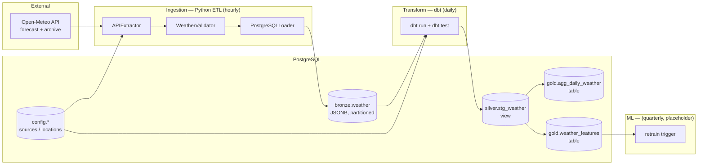

# env-data-pipeline — Technical Documentation

> A production-style environmental **weather data engineering pipeline** for **Cambodia's 25 provinces**.
> It ingests data from the [Open-Meteo](https://open-meteo.com/) API into PostgreSQL, transforms it through a
> **medallion architecture** (bronze → silver → gold) with **dbt**, orchestrates everything with
> **Apache Airflow** (Celery), and prepares an ML feature store for weather forecasting.

---

## 1. Table of Contents

1. [System Overview](#2-system-overview)
2. [Architecture](#3-architecture)
3. [Technology Stack](#4-technology-stack)
4. [Repository Layout](#5-repository-layout)
5. [Data Model](#6-data-model)
6. [Ingestion Layer (Python ETL)](#7-ingestion-layer-python-etl)
7. [Transformation Layer (dbt)](#8-transformation-layer-dbt)
8. [Orchestration Layer (Airflow DAGs)](#9-orchestration-layer-airflow-dags)
9. [Machine Learning Layer](#10-machine-learning-layer)
10. [Configuration & Environment](#11-configuration--environment)
11. [Deployment (Docker)](#12-deployment-docker)
12. [Setup & Runbook](#13-setup--runbook)
13. [Testing](#14-testing)
14. [Known Issues & Technical Debt](#15-known-issues--technical-debt)

---

## 2. System Overview

The pipeline collects **hourly weather observations** for the 25 provinces of Cambodia and turns raw API
responses into analytics-ready and ML-ready datasets.

| Concern | Choice |
|---------|--------|
| **Domain** | Weather / environmental data, Cambodia (25 provinces) |
| **Source** | Open-Meteo forecast API (live) + archive API (historical backfill) |
| **Pattern** | Medallion architecture — bronze (raw) → silver (clean) → gold (aggregated / features) |
| **Ingestion** | Python ETL (Extract → Validate → Load) |
| **Transformation** | dbt (SQL) |
| **Storage** | PostgreSQL (JSONB, partitioned by year) |
| **Orchestration** | Apache Airflow with CeleryExecutor + Redis |
| **Packaging** | Docker Compose |

**Design principle:** the bronze layer stores the *complete, uninterpreted* API response as JSONB.
No values are dropped or transformed on the way in. All cleaning, typing, deduplication, and business logic
happen later in dbt. This keeps ingestion fast and makes the raw data fully replayable.

---

## 3. Architecture

### 3.1 End-to-end data flow



### 3.2 Layer responsibilities

| Layer | Schema | Materialization | Built by | Purpose |
|-------|--------|-----------------|----------|---------|
| **Config** | `config` | Tables | `scripts/setup_config.py` | Sources, provinces, source↔location mapping |
| **Bronze** | `bronze` | Partitioned table (JSONB) | Python loader | Raw, append-only API responses |
| **Silver** | `silver` | View | dbt (`stg_weather`) | Typed, deduplicated, enriched hourly readings |
| **Gold** | `gold` | Tables | dbt (`agg_daily_weather`, `weather_features`) | Daily BI aggregates + ML feature store |

---

## 4. Technology Stack

| Layer | Technology | Version | Notes |
|-------|------------|---------|-------|
| Language | Python | 3.11 | Docker base image |
| Orchestration | Apache Airflow | 2.7.3 | Installed via Docker image, **not** in `requirements.txt` |
| Executor | CeleryExecutor | — | Redis broker + Postgres result backend |
| Broker | Redis | 7.2 | Celery message broker |
| Transformation | dbt-postgres | 1.7.0 | Silver/gold models |
| dbt package | dbt_utils | ≥1.0.0 | Via `packages.yml` |
| Database | PostgreSQL | 15 | Airflow metadata DB; pipeline DB is local/external |
| HTTP client | requests | 2.31.0 | Open-Meteo calls |
| Data libs | pandas / numpy | 2.1.0 / 1.25.0 | Utilities |
| DB driver | psycopg2-binary | 2.9.7 | Postgres connections |
| Config | python-dotenv | 1.0.0 | `.env` loading |

---

## 5. Repository Layout

```
env-data-pipeline/
├── dags/                       # Airflow DAG definitions
│   ├── weather_ingest_dag.py       # hourly ingestion (bronze)
│   ├── weather_transform_dag.py    # daily dbt build (silver + gold)
│   └── weather_ai_retrain_dag.py   # quarterly ML retrain (placeholder)
│
├── pipeline/                   # Python ETL core
│   ├── extractor.py                # APIExtractor — fetch from Open-Meteo
│   ├── validator.py                # WeatherValidator — structural checks
│   ├── loader.py                   # PostgreSQLLoader — write JSONB to bronze
│   └── pipeline.py                 # Pipeline orchestrator (extract→validate→load)
│
├── repository/                 # Config data-access layer
│   ├── location_repository.py      # get_active_locations(source_id)
│   └── source_repository.py        # get_source(source_id)
│
├── dbt_project/                # dbt transformations
│   ├── dbt_project.yml             # model config (silver=view, gold=table)
│   ├── profiles.yml                # connection profiles (gitignored)
│   ├── packages.yml                # dbt_utils
│   ├── macros/                     # generate_schema_name override
│   └── models/
│       ├── sources.yml             # bronze + config source definitions
│       ├── silver/stg_weather.sql  # clean/typed/deduped hourly view
│       └── gold/
│           ├── agg_daily_weather.sql   # daily BI aggregates
│           └── weather_features.sql    # ML feature store
│
├── scripts/                    # Setup & backfill
│   ├── setup_config.py             # create config schema + seed 25 provinces
│   ├── setup_bronze.py             # create partitioned bronze.weather
│   ├── setup_db.py                 # test connection + create schemas
│   ├── backfill_historical.py      # load 2020→today from archive API
│   └── default.sql                 # DB/user creation + runbook notes
│
├── utils/                      # Shared infrastructure
│   ├── db.py                       # get_connection(), setup_schemas()
│   ├── schema.py                   # bronze DDL + get_or_create_partition()
│   └── logger.py                   # file + console logger
│
├── tests/                      # Manual integration scripts
│   ├── test_extractor.py
│   ├── test_backfill.py
│   └── test_pipeline.py
│
├── docker/
│   ├── Dockerfile                  # airflow 2.7.3 + project deps
│   └── .dockerignore
│
├── docker-compose.yml          # Airflow (web/scheduler/worker/init) + Redis + Postgres
├── requirements.txt
└── docs/TECHNICAL.md           # this document
```

---

## 6. Data Model

### 6.1 `config` schema — configuration & seed data

Created and seeded by `scripts/setup_config.py`.

**`config.sources`** — registered API sources
| Column | Type | Notes |
|--------|------|-------|
| `id` | SERIAL PK | |
| `source_name` | VARCHAR(100) | e.g. `Open-Meteo` |
| `api_url` | TEXT | forecast endpoint |
| `frequency` | VARCHAR(20) | `hourly` |
| `rate_limit` | INTEGER | requests/day (10000) |
| `requires_key` | BOOLEAN | `false` for Open-Meteo |
| `timeout_sec` | INTEGER | request timeout (30) |
| `is_active` | BOOLEAN | soft enable/disable |

**`config.locations`** — the 25 Cambodian provinces
| Column | Type | Notes |
|--------|------|-------|
| `id` | SERIAL PK | |
| `name` / `name_khmer` | VARCHAR | English + Khmer names |
| `latitude` / `longitude` | NUMERIC(9,6) | coordinates |
| `region` | VARCHAR(50) | Central / Northern / Highland / Coastal / Eastern |
| `population` | INTEGER | |
| `elevation_m` | INTEGER | used for elevation categories |
| `timezone` | VARCHAR(50) | default `Asia/Phnom_Penh` |
| `is_active` | BOOLEAN | |

**`config.source_locations`** — many-to-many (source × province)
| Column | Type | Notes |
|--------|------|-------|
| `id` | SERIAL PK | |
| `source_id` → `config.sources(id)` | FK | |
| `location_id` → `config.locations(id)` | FK | |
| `custom_params` | JSONB | optional per-location extra API fields |
| `priority`, `last_fetched`, `is_active` | | scheduling metadata |
| UNIQUE(`source_id`, `location_id`) | | prevents duplicates |

**`config.model_retrain_log`** — created lazily by the AI retrain DAG to track model retraining runs.

### 6.2 `bronze.weather` — raw layer

Defined identically in `utils/schema.py` and `scripts/setup_bronze.py`; created by `setup_bronze.py`.

```sql
CREATE TABLE bronze.weather (
    id               BIGSERIAL,
    source_id        INTEGER NOT NULL,
    location_id      INTEGER NOT NULL,
    observation_at   TIMESTAMP NOT NULL,
    raw_data         JSONB NOT NULL,      -- complete API response
    ingested_at      TIMESTAMP NOT NULL DEFAULT NOW(),
    data_type        VARCHAR(20) NOT NULL DEFAULT 'live',  -- 'live' | 'historical'
    PRIMARY KEY (id, observation_at)
)
PARTITION BY RANGE (observation_at);
```

- **Partitioned by year** (`bronze.weather_2020`, `bronze.weather_2021`, …). Partitions are auto-created on
  demand by `get_or_create_partition(cur, year)`.
- **Indexes:** `location_id`, `source_id`, `observation_at DESC`, `ingested_at DESC`, and a **GIN index on
  `raw_data`** for JSONB queries.
- **Append-only.** Nothing is ever updated in place; deduplication happens in silver.
- **No DB-level FK constraints** (partitioned tables + performance). FK integrity is enforced at the
  application level in the loader.

### 6.3 `silver.stg_weather` — cleaned view

dbt view that unpacks `raw_data->'current'` into typed columns and enriches them. See §8.1.

### 6.4 `gold` tables

- **`gold.agg_daily_weather`** — daily aggregates per province for BI/reporting.
- **`gold.weather_features`** — ML feature store with lags, rolling windows, cyclical encodings, and target
  labels. See §8.2.

---

## 7. Ingestion Layer (Python ETL)

The ingestion code follows a clean **Extract → Validate → Load** separation, each stage behind an abstract
base class and sharing a common logger.

### 7.1 `Pipeline` (`pipeline/pipeline.py`)

Orchestrates the three stages and records run metrics (rows extracted/rejected/loaded, per-stage timings,
rejection rate). Aborts early if extraction returns nothing or if all rows are rejected.

```19:66:pipeline/pipeline.py
    def run_pipeline(self):
        self.logger.info(f"Starting: {self.name}")
        total_start = time.time()

        # ── Stage 1: Extract ──────────────────────────────
        self.logger.info("Stage 1/3 — Extract")
        t0        = time.time()
        raw_rows  = self.extractor.extract()
        t_extract = round(time.time() - t0, 3)
```

### 7.2 `APIExtractor` (`pipeline/extractor.py`)

- Loads source config via `repository.source_repository.get_source(source_id)` and active locations via
  `repository.location_repository.get_active_locations(source_id)`.
- Requests these **current** fields from Open-Meteo: `temperature_2m`, `relative_humidity_2m`,
  `wind_speed_10m`, `wind_direction_10m`, `precipitation`, `weather_code`, `surface_pressure`, `cloud_cover`,
  `visibility`, `wind_gusts_10m` (plus any `extra_fields` from `custom_params`).
- Emits one row per location: `{source_id, location_id, location_name, observation_at, raw_data}` where
  `observation_at` comes from `raw_data.current.time`.
- Per-location failures are caught and logged; a failure for one province does not abort the batch.

### 7.3 `WeatherValidator` (`pipeline/validator.py`)

**Structural** validation only — deliberately *not* business rules (those live in dbt). Applies 8 sequential
rules per row and returns `(valid_rows, ValidationResult)`:

1. Required pipeline fields present (`source_id`, `location_id`, `raw_data`)
2. `raw_data` is a dict
3. No API error field in the response
4. Required top-level fields present (`latitude`, `longitude`, `timezone`, `current`)
5. `current` block exists and is a dict
6. Required current fields present (`time`, `temperature_2m`, `relative_humidity_2m`, `wind_speed_10m`,
   `precipitation`, `weather_code`)
7. `observation_at` present and not in the future
8. `source_id` / `location_id` are positive integers

`ValidationResult` tracks totals and exposes `rejection_rate()`.

### 7.4 `PostgreSQLLoader` (`pipeline/loader.py`)

- On init, loads valid `source_id`/`location_id` sets from `config` for **application-level FK validation**
  (`_validate_ids`), replacing the missing DB constraints.
- Before inserting a batch, calls `_ensure_partitions()` to create any missing yearly partitions.
- Inserts `raw_data` as JSON (`json.dumps`) into `bronze.weather`. Rows with invalid IDs are skipped (not
  fatal); other errors are counted.
- `fetch_latest()` returns recent rows joined to `config` for verification, reading fields directly out of
  the JSONB.

---

## 8. Transformation Layer (dbt)

dbt project config (`dbt_project/dbt_project.yml`):

```12:19:dbt_project/dbt_project.yml
models:
  dbt_project:
    silver:
      +materialized: view
      +schema: silver
    gold:
      +materialized: table
      +schema: gold
```

Sources are declared in `dbt_project/models/sources.yml` (`bronze.weather` + the three `config` tables), with
`not_null` tests on the key bronze columns. A `generate_schema_name` macro forces the literal `silver`/`gold`
schema names rather than dbt's default prefixing.

### 8.1 Silver — `stg_weather.sql` (view)

Pipeline of CTEs:

1. **`unpacked`** — casts `raw_data->'current'->>'...'` JSONB values into typed columns
   (`temperature_c`, `humidity_pct`, `wind_speed_kmh`, `precipitation_mm`, `pressure_hpa`,
   `cloud_cover_pct`, `visibility_m`, `weather_code`, …) and joins `config.locations` / `config.sources`
   for metadata. Derives date parts (`observation_date`, `observation_hour`, `observation_month`,
   `observation_year`).
2. **`with_descriptions`** — adds derived business fields:
   - `weather_description` from the WMO `weather_code`
   - `season` / `is_rainy_season` (Cambodia rainy season = May–October)
   - `heat_index_c` (simplified Steadman formula)
   - `comfort_level` (Comfortable → Extreme Danger based on temp + humidity)
3. **`deduplicated`** — `DISTINCT ON (location_id, observation_date, observation_hour)` ordered by
   `ingested_at DESC`, so the **latest ingested reading per location-hour wins**. This is where duplicate
   ingestions are collapsed.

### 8.2 Gold — `agg_daily_weather.sql` (table)

Daily aggregates per province intended for BI dashboards: temperature min/avg/max/range, humidity stats,
wind stats, total & max precipitation, rainy-hours count, pressure/cloud averages, heat-index stats, and
data-quality counts (`hourly_readings_count`, `hours_covered`), plus classification columns.

### 8.3 Gold — `weather_features.sql` (table)

The **ML feature store**, built in four CTE steps:

1. **`daily`** — daily aggregation per province (same grain as above).
2. **`with_lags`** — lag features per location ordered by date: temperature lags (1/2/3/7/14/30d), humidity
   lags (1/7/30d), precipitation lags (1/7d), `was_rainy_yesterday`, and temp deltas.
3. **`with_rolling`** — rolling windows: 7d/30d/90d average temp, 7d/30d humidity & precip sums, and
   consecutive rainy-day counts (7d/30d).
4. **`with_calendar`** — calendar features (`day_of_year`, `day_of_week`, `week_of_year`, `quarter`),
   **cyclical sin/cos encodings** for month and day-of-year, `region_code`, `elevation_category`,
   `temp_anomaly_30d`, extreme-weather flags, and the **target labels**:

| Target column | Definition |
|---------------|------------|
| `target_next_day_temp` | `LEAD(avg_temp_c, 1)` per location |
| `target_next_day_precip` | `LEAD(total_precipitation_mm, 1)` per location |
| `target_will_rain_tomorrow` | `LEAD(precip>0 ? 1 : 0, 1)` per location |

A `dbt_updated_at` timestamp is stamped on each row for freshness checks.

---

## 9. Orchestration Layer (Airflow DAGs)

All DAGs prepend the project root to `sys.path` and use `owner="pipeline_user"`, `catchup=False`,
`max_active_runs=1`.

### 9.1 `weather_ingest` — hourly

```160:169:dags/weather_ingest_dag.py
with DAG(
    dag_id            = "weather_ingest",
    description       = "Hourly weather ingestion — 25 provinces → bronze.weather",
    default_args      = default_args,
    start_date        = datetime(2026, 7, 1),
    schedule_interval = "@hourly",
    catchup           = False,
    tags              = ["weather", "ingest", "bronze"],
    max_active_runs   = 1,       # only one run at a time
) as dag:
```

- At **parse time**, `load_active_locations()` reads active provinces from `config` and **dynamically
  generates one `PythonOperator` task per province**.
- Each province task runs `ingest_province()`: extract (filtered to that province) → validate → load, and
  pushes counts to XCom.
- Tasks run in the `weather_ingest_pool` (10 slots → max 10 concurrent API calls).
- A final `health_check` task (`trigger_rule="all_done"`) reads XCom from all provinces and **fails the DAG
  if the success rate drops below 80%**.
- Retries: 3, 5-minute delay.

### 9.2 `weather_transform` — daily at midnight (`0 0 * * *`)

Linear dependency chain:

```
check_bronze_freshness → dbt_run → dbt_test → verify_gold_tables
```

- **`check_bronze_freshness`** — fails if there are no rows in `bronze.weather` ingested in the last 25 hours
  (guards against building gold on stale data).
- **`dbt_run` / `dbt_test`** — `BashOperator`s that `cd` into `/opt/airflow/project/dbt_project` and run dbt
  against `--target dev` using profiles from `~/.dbt` (mounted into the containers).
- **`verify_gold_tables`** — prints row counts and `MAX(dbt_updated_at)` for both gold tables.
- Retries: 2, 10-minute delay.

### 9.3 `weather_ai_retrain` — quarterly (`0 0 1 */3 *`)

```
check_training_data → trigger_retraining → log_retrain_run
```

- **`check_training_data`** — verifies `gold.weather_features` has **≥100,000 rows with a non-null
  `target_next_day_temp`**; otherwise raises and stops.
- **`trigger_retraining`** — **placeholder**: logs stats and lists the target columns. The commented code
  shows the intended future integration (`ml.trainer.WeatherModelTrainer`).
- **`log_retrain_run`** — creates `config.model_retrain_log` if needed and records the run.

---

## 10. Machine Learning Layer

The ML layer is **scaffolded but not yet implemented**:

- The feature store (`gold.weather_features`) and target labels are fully built by dbt.
- `weather_ai_retrain` validates data readiness and provides the trigger point.
- Actual model training/evaluation/persistence is a placeholder awaiting an `ml/` package (e.g.
  `WeatherModelTrainer`). Intended tasks: temperature regression (`target_next_day_temp`), precipitation
  regression (`target_next_day_precip`), and rain classification (`target_will_rain_tomorrow`).

---

## 11. Configuration & Environment

### 11.1 `.env` (pipeline database credentials)

Loaded by `utils/db.py` via `python-dotenv`:

```
DB_HOST=host.docker.internal   # or localhost when running scripts directly
DB_PORT=5432
DB_NAME=<pipeline_db>
DB_USER=<pipeline_user>
DB_PASSWORD=<password>
```

`get_connection()` reads these; `DB_HOST` defaults to `localhost`.

### 11.2 dbt profiles (`dbt_project/profiles.yml`, gitignored)

Profile name `dbt_project` with `dev` / `prod` targets pointing at Postgres via the same `DB_*` env vars.
Inside Docker, the file is mounted from the host `~/.dbt`. Default connection host is
`host.docker.internal` so containers can reach a Postgres running on the host.

---

## 12. Deployment (Docker)

### 12.1 Image (`docker/Dockerfile`)

Based on `apache/airflow:2.7.3-python3.11`; installs `gcc`/`g++`/`libpq-dev`/`git`, then
`pip install -r requirements.txt`, copies the whole project to `/opt/airflow/project`, and sets
`PYTHONPATH=/opt/airflow/project`.

### 12.2 Services (`docker-compose.yml`)

| Service | Image / role | Port |
|---------|--------------|------|
| `postgres-airflow` | Postgres 15 — Airflow **metadata** DB | internal |
| `redis` | Redis 7.2 — Celery broker | 6379 (internal) |
| `airflow-webserver` | Web UI (admin/admin) | **8080** |
| `airflow-scheduler` | DAG scheduling | — |
| `airflow-worker` | Celery worker (runs tasks) | — |
| `airflow-init` | one-shot: `db upgrade`, create admin, create `weather_ingest_pool` (10) | — |

Shared config (via YAML anchor `x-airflow-common`): `CeleryExecutor`, pipeline `DB_*` env vars,
`PYTHONPATH`, and volume mounts for `./dags`, `./logs`, `./plugins`, the whole project (`.`), and `~/.dbt`.

> The **pipeline database itself is not containerized by default** — `postgres-pipeline` is commented out.
> Point `DB_HOST` at a host/external Postgres, or uncomment that service to run one in Docker.

---

## 13. Setup & Runbook

Recommended bootstrap order (from the code + `scripts/default.sql`):

```bash
# 1. Create the pipeline database & user (see scripts/default.sql), then set .env

# 2. Create config schema + seed the 25 provinces
python scripts/setup_config.py

# 3. Create the partitioned bronze.weather table + partitions + indexes
python scripts/setup_bronze.py

# 4. (Optional) Backfill historical data from 2020 → today
python scripts/backfill_historical.py

# 5. Build & start the Airflow stack
docker compose build
docker compose up -d

# 6. Open the UI and unpause DAGs
#    http://localhost:8080   (admin / admin)
```

Once running:
- `weather_ingest` fills `bronze.weather` every hour (one task per province).
- `weather_transform` runs dbt at midnight to (re)build silver + gold.
- `weather_ai_retrain` checks feature readiness quarterly.

### 13.1 Historical backfill

`scripts/backfill_historical.py` uses the Open-Meteo **archive** API (`archive-api.open-meteo.com`):
- From `START_DATE = 2020-01-01` to today, one year per request (`BATCH_DAYS=365`).
- `MAX_WORKERS=3` parallel province fetches, `REQUEST_DELAY=0.5s`, up to `MAX_RETRIES=5`.
- Resumes from the last loaded date and reuses `get_or_create_partition`.

---

## 14. Testing

`tests/` contains **manual integration scripts** (they hit the real DB/API), not automated pytest suites:

| File | What it exercises |
|------|-------------------|
| `test_extractor.py` | Full extract → validate → load → verify against a live DB |
| `test_backfill.py` | Backfill Phnom Penh for 2024 only |
| `test_pipeline.py` | End-to-end pipeline run (see caveat below) |

Run them directly, e.g. `python tests/test_extractor.py`, with a valid `.env` and a set-up database.

---

## 15. Known Issues & Technical Debt

The following are worth tracking (some may already be resolved as the code evolves):

1. **Duplicate bronze DDL.** The `CREATE TABLE` / index / comment SQL is defined in **both** `utils/schema.py`
   and `scripts/setup_bronze.py`. They currently match, but the duplication risks future drift. Prefer making
   `utils/schema.py` the single source of truth and importing from it. There are also two identical partition
   helpers (`get_or_create_partition` vs `create_yearly_partition`).
2. **`setup_bronze.py` self-containedness.** Ensure the script (a) fixes `sys.path` *before* importing
   `utils.*`, (b) imports names that actually exist in `utils/schema.py` (`CREATE_SCHEMAS`, not
   `CREATE_BRONZE_SCHEMA`), and (c) creates the `bronze` schema before `CREATE TABLE` so it works on a fresh DB.
3. **`utils/schema.py` idempotency.** `CREATE_BRONZE_WEATHER` uses `CREATE TABLE` (no `IF NOT EXISTS`), so
   re-running setup errors with "relation already exists".
4. **`test_pipeline.py`** may use an outdated `APIExtractor(source=...)` signature; the current API is
   `APIExtractor(source_id=...)`.
5. **API serving layer removed.** An earlier `api/` (FastAPI) package was deleted; the gold layer is designed
   to be served over REST, so this is a natural next build-out. (The current `docker-compose.yml` does **not**
   define a FastAPI service.)
6. **ML training is a placeholder** — see §10.
7. **`README.md`** is essentially empty; this document is the primary reference.

---

*Document generated from source. Cross-check against the code when in doubt — the code is the source of truth.*
